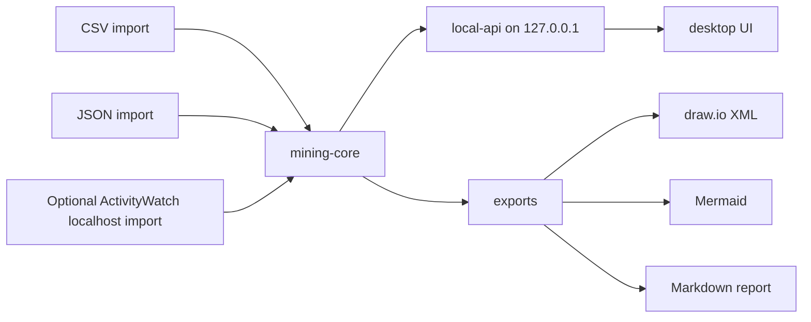

# Architecture

OpsMineFlow is a monorepo with local-only boundaries.

## Components

- `services/mining-core`: local normalization, masking, labeling, mining, scoring, and report generation.
- `services/local-api`: FastAPI app bound to localhost only.
- `packages/event-schema`: TypeScript types and JSON Schema.
- `packages/drawio-exporter`: draw.io mxfile XML generation.
- `apps/desktop`: Tauri-ready React UI.
- `scripts`: setup, test, lint, license, and local-only checks.

## Data Boundary

All runtime data remains local. No component should require remote services after dependencies are installed.

