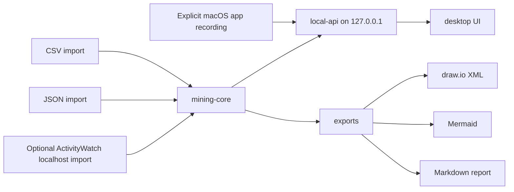

# Architecture

OpsMineFlow is a monorepo with local-only boundaries.

## Components

- `services/mining-core`: local normalization, masking, labeling, mining, scoring, and report generation.
- `services/local-api`: FastAPI app bound to localhost only.
- `mac-agent`: Swift-only frontmost-app recorder launched by an explicit WebUI session.
- `packages/event-schema`: TypeScript types and JSON Schema.
- `packages/drawio-exporter`: draw.io mxfile XML generation.
- `apps/desktop`: Tauri-ready React UI.
- `scripts`: setup, test, lint, license, and local-only checks.

## Data Boundary

All runtime data remains local. No component should require remote services after dependencies are installed.

## Desktop-to-API Boundary

In a packaged application, the React WebUI calls a narrow Tauri command surface. The Rust desktop runtime holds a per-launch API secret and proxies only a static allowlist of product operations to `127.0.0.1`. The command interface never accepts a caller-provided HTTP target, method, request headers, or filesystem path. The secret and destructive-operation challenge are never exposed to JavaScript, local storage, URLs, or logs.

The local API validates the exact loopback Host, rejects browser Origin requests in production, limits request bodies, and authenticates every WebUI product route. Rust first verifies sidecar ownership with an HMAC challenge on the same connection before it sends the WebUI API session secret. The recorder uses its own explicit recording-session control. `GET /health` and `GET /runtime/health` are the only unauthenticated endpoints; both return minimal metadata without opening the user-data store, while ownership identity requires the HMAC probe. Browser direct access requires an explicit insecure-development opt-in and is never a normal user path.

## File Boundary

The packaged UI does not accept filesystem paths from users. Rust opens Finder dialogs, validates the selected regular file or save folder, and returns only a short-lived opaque handle plus a display name to the WebUI. Each import revalidates the file type, extension, size, and symlink state before the Rust runtime forwards the selected path through its authenticated internal channel. Exports use a native save dialog rather than a typed target path.

## Collector Boundary

The native technical preview is bundled but stopped by default. It uses its own per-session token to send frontmost-app intervals to the localhost API and never writes directly to SQLite. The browser extension remains a separate opt-in roadmap item with optional domain permissions. Every collector must use a validated Tauri or localhost API boundary.

See [../product/COLLECTION_ROADMAP.md](../product/COLLECTION_ROADMAP.md).
