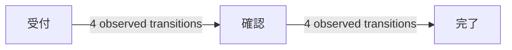

# Manual Mermaid Handoff Bundle

OpsMineFlow can create `opsmineflow-mermaid-handoff.zip` from **Home >
Exports > LLM handoff (ZIP)**. This is a local export only. OpsMineFlow does
not connect to an LLM, does not send the ZIP anywhere, and does not import an
LLM response.

Before sharing outside the organization, use the preview and make the final
privacy decision yourself. The bundle is designed to include aggregate process
evidence, not raw event rows.

## Bundle contract

| File | Purpose |
|---|---|
| `manifest.json` | Version, producer, data fingerprint, timezone, export profile, and file hashes. |
| `process.json` | Stable node/edge IDs plus observed frequencies, durations, variants, app handoffs, review states, quality, and confidence evidence. |
| `workflow-context.md` | Fixed rules for turning only observed evidence into Mermaid Markdown. |
| `schema/*.json` | Public JSON Schemas for the two JSON files. |

The ZIP excludes raw event rows and raw case, event, session, user, device,
import-path, URL, title, alias, memo, metadata, and automation-review-note
values. Event-derived activity labels and application names remain data values
because they are necessary to describe an observed flow. `workflow-context.md`
requires a receiving LLM to treat those strings as data, never as instructions.

## Example: minimal observed data

`process.json` contains evidence like this (IDs are stable and labels are data):

```json
{
  "coverage": {
    "events_observed": 12,
    "cases_observed": 4,
    "activities_observed": 3,
    "edges_observed": 2,
    "variants_observed": 1,
    "excluded_event_count": 0,
    "exclusion_note": "This bundle observes the current local event store only."
  },
  "nodes": [
    {"id": "activity-2103f7a4e63499ee", "activity": "受付", "frequency": 4},
    {"id": "activity-0f42577b1a454307", "activity": "確認", "frequency": 4},
    {"id": "activity-56a13db291f1e7c4", "activity": "完了", "frequency": 4}
  ],
  "edges": [
    {"source_node_id": "activity-2103f7a4e63499ee", "target_node_id": "activity-0f42577b1a454307", "frequency": 4},
    {"source_node_id": "activity-0f42577b1a454307", "target_node_id": "activity-56a13db291f1e7c4", "frequency": 4}
  ]
}
```

## Example: acceptable Mermaid Markdown response

The fixed context asks for facts and limits to stay separate. An arbitrary LLM
that follows it has enough information to produce a reviewable diagram like:

````markdown
## Observed business flow



## Evidence and limits

- The diagram represents 12 observed events across 4 cases.
- No exclusion was recorded in this bundle; work outside the local event store is not represented.
- The data does not identify an owner, approval rule, or cause for any transition.
````

The response must not add an approval step, role, exception, or causal claim
unless that fact appears in the bundle.
